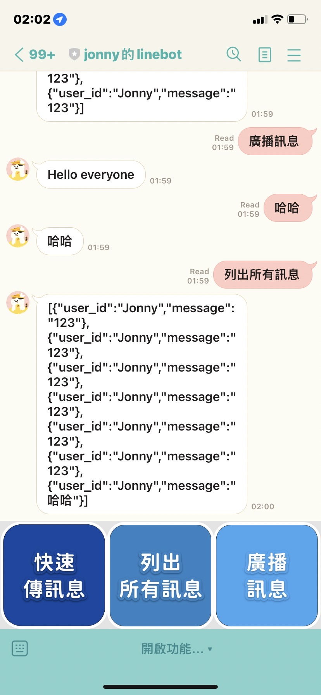

## Description
this line bot is built for interview

there are three APIs

First, save any text

Second, broadcast 

Third, get all messages
## Qrcode


you can scan this qrcode, play this bot and try to pass data 

I put the service in Heroku, maybe you should wait for 30 seconds if it slept

## Notice 
there are three APIs in this service, but I dont suggest use postman to hit them

I put them into linebot, you just scan it!

## Step

if you want to download this package, you should follow my steps

1. download it! 
2. copy env (you should get your line bot secret)
    ```
    cp .env.example .env
   ```
3. build & down MongoDB  
    ```
   sh up.sh
   sh down.sh
   ```
4. launch go service ( port 8001 )
    ```
    go run main m800LineBot
    ```
5. then, you can enjoy this service!

## Line Bot UI
